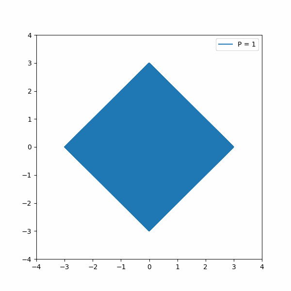

# Math

 ## Notes

  ( L^p  Space Metric Space )
  [Info](https://en.wikipedia.org/wiki/Lp_space)
-   d(x,y) = [|x_1 - y_|]^p + |x_2 - y_2|^P]^(1/p) 
- Taxicab Metric  → P = 1
- Euclidean Metric  → P = 2

<figure>
        
</figure>

  
  
  
ZFC  
Axiom Schema  
- AOC is equivalent to For All Vector Spaces there exists a basis

[Julia Set Fractal ](https://en.wikipedia.org/wiki/Julia_set)  
[Mathematics and CS Notes](https://crypto.stanford.edu/pbc/notes/)  
[PBC Cryptography Library](https://crypto.stanford.edu/pbc/)  
[N-Catergory Cafe](https://golem.ph.utexas.edu/category/)  
[MIRI Math Research Guide](https://intelligence.org/research-guide/) (Many of the books listed below are from this list)  

## Books
  [Linear Algebra and Its Applications ](https://www.goodreads.com/book/show/179699.Linear_Algebra_and_Its_Applications)  
  [Elements of Set Theory ~ Enderton](https://www.goodreads.com/book/show/558206.Elements_of_Set_Theory)  
  [Intro to Logic ~ Enderton](https://www.goodreads.com/book/show/250872.A_Mathematical_Introduction_to_Logic)  
  [How To Prove It: A structure Approach](https://www.goodreads.com/book/show/739735.How_to_Prove_It?from_search=true&from_srp=true&qid=XaiPOtPCwl&rank=1)  
  [Logic: The Laws of Truth](https://www.goodreads.com/book/show/13748126-logic?from_search=true&from_srp=true&qid=5ewyZxkEnJ&rank=1)  
  [Topology](https://topology.mitpress.mit.edu/)  
  [Naive Set Theory](https://www.goodreads.com/book/show/558194.Naive_Set_Theory?ac=1&from_search=true&qid=VlbfdVrLSK&rank=1)
  [Computability and Logic](https://www.goodreads.com/book/show/1556746.Computability_and_Logic?ac=1&from_search=true&qid=zrLHnTlIxG&rank=1)  
  [Probability Theory: The logic of science](https://smile.amazon.com/Probability-Theory-The-Logic-Science/dp/0521592712/)  
  [Probalistic reasoning in intelligent systems](https://smile.amazon.com/Probabilistic-Reasoning-Intelligent-Systems-Representation/dp/1558604790/)  
  [All of Statistics](https://www.amazon.com/All-Statistics-Statistical-Inference-Springer/dp/0387402721)    
  [An Introduction to Decision Theory](https://www.goodreads.com/book/show/11729796-an-introduction-to-decision-theory?ac=1&from_search=true&qid=xdqDQGz58l&rank=1)  
  [The logic of Provability](https://www.goodreads.com/book/show/1572785.The_Logic_of_Provability?ac=1&from_search=true&qid=wge8W9e0gl&rank=1)  
  [Introduction to Elliptic Curves and Modular Forms](https://www.goodreads.com/book/show/1874243.Introduction_to_Elliptic_Curves_and_Modular_Forms)