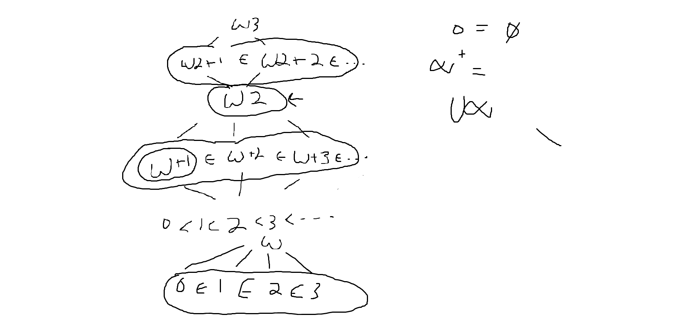

# Set Theory

## Books

[Naive Set Theory](https://www.goodreads.com/book/show/558194.Naive_Set_Theory?ac=1&from_search=true&qid=VlbfdVrLSK&rank=1) 
[Elements of Set Theory ~ Enderton](https://www.goodreads.com/book/show/558206.Elements_of_Set_Theory)  

## Notes

Notes are from [Naive Set Theory](https://www.goodreads.com/book/show/558194.Naive_Set_Theory?ac=1&from_search=true&qid=VlbfdVrLSK&rank=1)  

- "naive" and "axiomatic" are contrasting words  
- Naive set thoery is axiopmatic in that some axioms for set theory are stated and used as teh basis of all subsequent proofs. However is naive that the language and notations are informal and axioms being brief and based of clear logical relations
## Fundamental Set Theory
- **Axiom of Extension** Two sets are equal iff they have the same elements  
- The wording of the axiom of extension states that a set must be included in itself this relation can be thought of reflexive  
- Given A and B if  A \subset B  and A \neq B  the word proper is used.  
- Given a set A, B, C if  A /subset B  and  B \subset C \implies A \subset C . Thus set inclusion is transitive.  
- Given a set A, B if  A \subset B  and  B \subset A  then A = B . Thus set inclusion is antisymmetric. Set inclusion is also sysmmetric.   
- belonging = \in  and inclusion = ( \subset)  
Note: inclusion is transitive  
- Two basic type of sentences, x \in A  and  A = B     
- **Axiom of specification**: To every set A and to every condition S(x) there corresponds a set B whose elements are exactly those x of A for which S(x) holds.  
Note: Customarily written as  B = \{ x \in A: S(x)\}   
- In older pre-axiomatic approaches to set theory the existence of a universe was taken for granted, and thea argument  in the preceding paragraph was known as the Russel Paradox.  
- The axiom of extension implies there can only be one set with no elements this is commononly denoted with  \emptyset  know as the empty set.  
- The empty set is a subset for every set  
- **Axiom of Pairing**: For any two sets there exists a set that they both belong to  
- The axiom of extension implies there can only be one set that containers exactly two other sets. This is usually denoted with \{a,b\}  given a set a and b.  
- **Axiom of Unions**: For every collection of sets there exists a set that contains all the elements that belong to atleast one set of the given collection.
Note: Commonly written as \cup \{X: X\in \mathcal{C} \}   
-  A \cap B = \{ x : x \in A ^ x \in B \}  known as the intersection of set A and B where the intersection only contains elements within both sets.  
- **De Morgan Laws**: ( A \cup B)' = A' \cap B'   and  (A \cap B)' = A' \cup B' 
- **Axiom of Powers**: For each set there exists a collection of sets that contains among its elements all the subsets of the given set.  
- The order pair of a and b with first coordinate a and second coordinate b is the set (a, b) defined by  (a,b) = \{ \{ a| , \{a, b\} \}.  
- Cartesian product of A and B; it is characterized by the fact that  A \times B = \{ x : x = (a.b) \}   for some a in A and some b in B  
- A set is an equivalence relation if it is reflexive, symmetric, and transitive.  
- If X and Y are sets, a function from (or on) X to (or into) Y is a relation f such that dom f = X and such that for each x in X there is a unique element y in Y with (x,y) in f.   
- For relations in general and functions in particular  there are concpets of domain and range. The domain of a function f from X into Y is definition equal to X, but its range need not be equal to Y, the range consists of those elements y of Y for which there exists an x in X such that f(x) = y  
- A function that always maps distinct elements onto distinct elements is called one-to-one. 
## Composites  
- Functional composition may not be commutative, but it is always associative 
## Numbers  
-  0 = \emptyset ,  1 = \{ \emptyset \} , 2 = \{0, 1\}   or  2 = \{ \emptyset, \{ \emptyset \} \} ...  
- **Axiom of Infinity** There exists a set containing 0 and containing the sucessor of each of its elements  
- A natural number by definition is the element of the minimal sucessor set  \omega   
- A family \{ x_i \}  whose index set is either a natural number or else the set of all natural numbers is called a sequence.   
- Two natural numbers are ALWAYS comparable.  
- If m includes n or m is a proper subset of n we can write this as m < n and say that m is less than n.  
- Every proper subset of a natural number n is equivalent to some small natural number. 
## Order
- If for every x and y in X either x less than y or y < x then this is called a total or linear order. A total ordered set is frequently called a chain.  
- If X is a partially order set, an element a of X is called a minimal element of X in case there is no element in X strictly smaller than a.  
- It a set E contains a greatest element than a is called the greatest lower bound of E.  
- **Axiom of Choice**: The cartesian product of a non-empty family of non-empty sets is non-empty.  
- **Zorn's Lemma**: If X is a partially ordered set such that every chain in X has an upper bound then X contains a maximal element. (Equivalent to AOC).  
- every well ordered set is totally ordered.  
- **WEll ordering theorem**: Every set can be well ordered.  
## Ordinal Numbers
- **Axiom of subsitution**: If S(a,b) is a sentence such that for each a in a set A the set \{ b: S(a,b) \}  can be formed then there exists a function F with domain A such that F(a) = \{ b:S(a,b) \}  for each a in A.  
-  \omega + 3 = 0<1<2<3<...<...<0<1<2  
-  \omega + 1 = 0<1<2<3<...<...<0  
-  \aleph_0 = \omega 
- For any ordinal \mathcal(a) ,  \mathcal(a) + 0 = 0 + \mathcal(a) = \mathcal(a) .  
- Not every transfinite ordinal number has an immediate predeccsor; the ones that do not are called limit numbers.
- Ordinal arithemetic is not entirely communative but it is associative.
- If both ordinals are finite than arithmetic is communative but not if one is infinite.
- **Counting Theorem** Each well ord ered set is similar to a unqiue ordinal number  
- Every subsetof w is countable. Thus \omega - \{1\}  is countable. 
 

  
## Other
- **Cantor's Theorem** Every set is strictly dominated by its power set.

