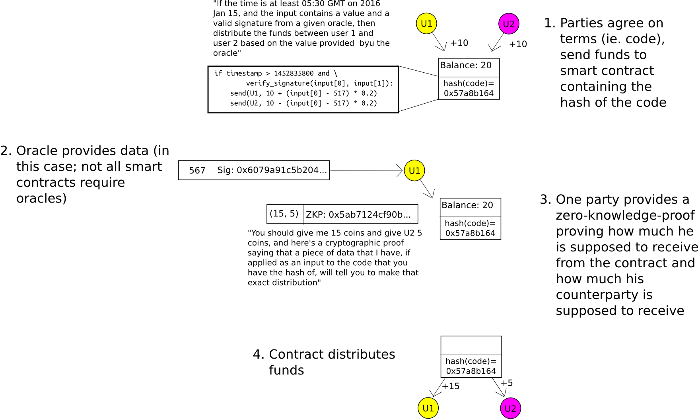

# Zero Knowledge Proofs

## Links
[ZK Proofs for Children](http://pages.cs.wisc.edu/~mkowalcz/628.pdf)  
[ZK proofs resources](https://ethresear.ch/t/zero-knowledge-proofs-starter-pack/4519)

## Notes
Zcash is derived from the fact that shielded transactions can be fully encrypted on the blockchain but still verified using ZK-SNARK proofs

zk-SNARK = Zero Knowledge Succinct Non-Interactive Argument of Knowledge, and refers to a proof construction where possession of a secret key can be verified without any interaction between the prove and verified or revealing any info. i.e: Proves proves to the verified that a statement is true.

- Succint: the sizes of the messages are tiny in comparison to the length of the actual computation
- Non-interactive, there is no or little interaction. For zksnarks there is usually a setup phase and after that a single message from the prover to the verifier. Furthermore, SNARKS often have so called public verifier properties meaning that anyone can verify without interacting anew
- ARguments, the verifier is only protected against computationally limited provers. Provers with enough power can create proofs about wrong statements. I.e computational soundness
- of Knowledge, it is not possible for the prover to consturct a proof without knowing a certain so called witness, (address she wants to spend from, the preimage of hash function, or the path to a certain Merkle-tree node)
- zero-knowdge prefix requires that during the interaction the verifier learns nothing apart from the validity of the statement, especially not the witness string.

Current efficient non-interactive zk proofs rely on a setup phase where a reference string is shared between users.

Neither the size of the witness string nor the computational efort require to verify the QSP play any role in verification. This means that SNARK verify complex problems and very simple problems take the same effort

Public parameters are generated through a parameter generation ceremony.

### Parameter Generation

[Parameter Generation](parameter_generation/)

Instead of computing v_a w_b and their product a verifier chooses a secret random point s , referred to as toxic waste in zcash, and computes t(S) v_k(s) and w_k(S) for all k and from them v_a(s)  and   w_b(s)  and only  t(S)h(s) = v_a(s)w_b(s). A bunch of polynomial additions, multiplications with a scalar and polynomial product can be simplifies to field multiplications and additions.

### Overview

Computation → Arithmetic Circuit → R1CS → QAp → zk-SNARK

R1CS = Rank 1 Constraint System and checks that the values are "traveling correctly"

Creating shielded transactions in Zcash is one example of zk-SNARKS. But it can be used to verify any relation without disclosing inputs or leaking information.

4 Main ingredients:

A). Encoding as a polynomial problem

The program is converted into a quadratic equation of polynomials 

t(x)h(x) = w(x)v(x)

where the equality holds iff the program is computer correctly. The prover WANTS to convince the verifier that the equality holds.

B). Succinctness by random sampling

The verifies chooses a secret evaluation point s to reduce the problem from multiplying polynomials and verifying function equality to multiplication and equality of numbers

t(s)h(s) = w(s)v(s)

C). Homomorphic encoding/encryption 

An encoding function E is used that has some homomorphic properties that allows the prover to computer E(t(s)), E(h(s)), E(w(s)), E(v(s)) without knowing s. she only knows E(s)

D). Zero knowledge

The prover permutes the values E(t(S), E(h(s)), E(w(s)), E(v(S)) by multiplying with a number so that the verifier can still check for the correct structure without knowing the actual value.

t(s)h(s) =w(s)v(s) === t(s)h(s)k = w(s)v(s)k

For a random secret number k where k not 0 then these two are equivalent. However it is impossible to derive t(s)h(s) or w(s)v(s) with the k

[RSA Intermission](http://localhost:1313/docs/zk_proof/rsa_intermission/)

[NP and Complexity-Theoretic Reduction](np/)

[QSP Quadratic Span Program](qsp/)

## Ethereum

