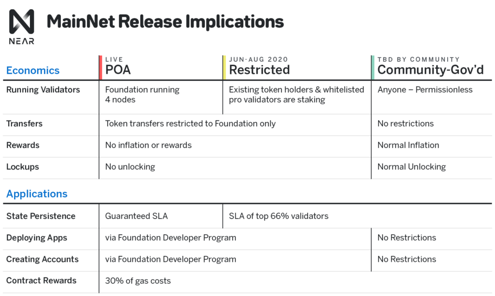

# NEAR Protocol
---
## Links
[Near Protocol](https://github.com/nearprotocol)   
[Documentation](https://docs.near.org/)  
[Near Wallet](https://wallet.nearprotocol.com/)  
[EThereum Rainbow Bridge Github](https://github.com/near/NEPs/pull/38/files#diff-52bcc808874f40c00fc81ed3f3e62422)  
[Rainbow Bridge](https://github.com/near/rainbow-bridge)  
[Contracts Development](https://docs.near.org/docs/roles/developer/contracts/assemblyscript)  
[Roadmap](https://near.org/blog/mainnet-roadmap/)  
[NEAR INFO](https://www.notion.so/dacef897e79c40299a7d49def98c5248)  
[Economics Whitepaper](https://near.org/blog/near-protocol-economics/)  
[Evolution of the Web Blog Post](https://near.org/blog/the-evolution-of-the-open-web/)  
[Whitepaper](https://near.org/papers/the-official-near-white-paper/)  

## Overview

NEAR is a decentralized application platform designed to enable the open web of the future.  Decentralization cost more why is it important **Because not all data is created equal.**

## Economics

NEAR provides developers a part of the fees that are generation on the transactions that are being interacting with their smart contracts. Thus early infrastructure is encouraged.

NEAR Token

- Pay the system for processing information and transactions
- Run a validating node and participate in staking
- Determine how network resources are allocated and where its future direction will go through governance
- General

NEAR is a decentralized application platform which runs atop the NEAR Protocol blockchain. The blockchain runs on hundreds of nodes that are permissionless and performant. Near is a platform which has access to a shared and secure pool of money, identity and data.

"one token equals one vote" to govern system

Accounts have human-readable names  and accounts offer "single sign on " functionality 

1. Threshold proof of stake

    ensure that computations run are correct by requiring near tokens as collateral for validators. this is the fundamental mechanism for securing the network. The threshold for participating in the system is set algorithmically at the lowest level to broadcast participation of validating days

2. Node operators are paid for their service a fixed percentage of total supply as a security fee  of roughly 4.5% annualized.
3. The protocol treasury receives 0.5 total supply to reinvest into the ecosystem
4. Transaction cost the instantaneous cost of every transaction is largely predictable and is paid in NEAR tokens.
5. Continual storage is a ongoing burden to nodes, storage costs are covered by maintaining minimum balance of NEAR tokens on the contract and account state of nodes.
6. Inflation is the combination of payouts to validators and to the treasury minus the collected transaction fee
7. Scaling Threshold  **Driven by economic features, scalingness** 
8. Security Threshold, some thresholds are provided for good behavior

 

Unlike Ethereum which bundles CPU, network and storage fees into a single transaction fees that is then takes place in a auction-based system NEAR relies on predictable pricing model which is based on characteristics of the system

CPU, network and storage fees are determined by a host of features, the gas price is predictable **but not fixed.**

Storage is a long term scare asset for an application to use it they must maintain minimum balance that scales linearly with amount of storage such account takes. 

Accounts and contracts are assigned to a shard because of usage of such contracts is not equal the size of some shards are different then others. Near supports resharding which gets rid of this. Which balances shards periodically based on conditions. The end result will be a set of shards that are reasonably the same.

During each day stats are collected that evaluate contract usage during previous epochs and its storage. Contracts are then bucketed into groups such that each bucket roughly the same expected characteristics.

As need shards are add the price per set goes down and more validators are added. If storage found in a previous epoch exceeds a certain threshold a number of new shards will be allocated increasing the number of buckets.

An auction process determines the amount of seats that will be allocated to each prospective (

Hidden validators are compensates for validation and signing off on the validity of chunks and block as normal part of the validator compensation process. ****

Contract Rewards are a 30% fee that is given to developer from the transaction. 

Fisherman are observing nodes who detect and report bad behavior, they are not rewarded for operating such a node but typically have outside motivation. 

Two main types of malicious behavior possible 

- Double Signing: singing two or more different blocks at the same height
- Invalid Chunks: Signing a chunk with an invalid data or computation result

## General

Near uses a sharding approaching which allows the network to increases its capacity by splitting the network nodes into multiple shards when usage is high enough and parallelizing computation across those shards Network can scale continuously with demand.

- Intra-sharding
- cross-shard

NEAR Protocol assumes that transactions will touch multiple shards by defaults 

NEAR uses a staking mechanism called "Threshholded Proof of stake" which is specifically designed to be both deterministic and broadly fair so it doesn't incentivize pooling of large validations

The near platform == ethereum platform where smart contracts are written to where front facing applications are found. 

Tokens can be wrapped from other chains and can easily stored and moved using the underlying platform. 

NFT's are supported and can be stored and move on the platform

## Development

1. NEAR allows developers to take actions on behalf of their users which allows them to onboard users without users needing to provide a wallet or interact with tokens directly upon reaching the app.
2. Contract-based accounts allow for easy creation of subscriptions and custom permission for applications
3. NEAR model allows developers to pay for infrastructure similar as traditional web services do today.   
4. Predictable pricing

NEAR runs on Web Assembly which can be compiled from a host of popular languages.

Developer Business Models are offered to support developers using NEAR

Key technology:

- Sharding: The system is designed to scale horizontally and near infinitely by distributing computation parallelized shards.
- Consensus: Consensus is achieved across all nodes which make up network operators across all shards
- Staking Selection and Game Theory: To Participate in the validation process, stakers are selected using a secure and radom process who distributes seats across parties and provides incentives for them to operate with good behavior.
- Randomness, can tolerate 1/3  bad actors before liveness is affected and 2/3 before outputs are effected

### Sharding

1. Vertical Scaling

Current vertical scaling relies on a small select group of optimized node operators who can increase performance on a notice.

2.  Horizontal Scaling

Current models show that adding *more* hardware ensures more nodes and thus hopes to improve performance in the network. 

### Cross-Chain / Cross-Shard Communication

1. Dual Validation

Have validators for the receiving chain also validate on the sending chain. (Used by quarkchain)

  2.  Trust the Transaction

Assume that if a transaction has received it must be valid, (used by cosmos, transactions copied are irreversible, the main chain keep track of tokens in each economy so you cannot create new ones but invalid transfers may occur)

  3. Beacon Chain w/ Rollback 

A beacon chain verifies the state transitions of all of the other chains using a small subset of validators,if a problem is detected all chains are rolled back. 

### Nightshade

Nightshade modifies typical sharding abstraction and assumes that all of the other shards combine to produce a single block, Blocks are produced with a normal cadence regardless whether each shard has reached its block height.  For each individual shard and period a single validator is assigned to produce its chunk. 

Hidden validators are a small committee for each shard who verify each chunk, however instead of being assigned a shard they are given a shard id through a verifiable random function (**Look into VRF !!)**

Hidden valdators can produce a fraud proof for a given shard

The number of hidden validators assigned to a block is randomly determined. If there are 100 seats per shard and 100 shards there are a total of 10,000 seats. 100 of them will be allocated to be chunk producers and the rest will be hidden validators.

Fishermen are 3rd party node operators that can provide the same fraud proof as a hidden validators.

Think of tokens as an open api, traditionally if someone wanted to use Reddit
s karma points in an application they would have to make an agreement with Reddit and then agree to use a private api, if karma was tokenized then it would be open for all and only restricted by the contract restrictions.

## Random

1. RANDAO unpredictable but bias-able liveness depends on the protocol
2. RANDAO and VDF 
3. Threshold signatures
4. RandShare

### Roadmap

Product was not built based of the whitepaper but first an MVP was build with developer tooling, a test wallet and a not-a-blockchain smart contract backend called DevNet

A hackathon took place where the team learned more about how smart contracts interact with a multi-shardered setup and the tools needed for developments. With this changes were made to the model and nightshade was made.


<figure>
      
</figure> 

